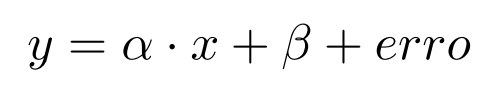
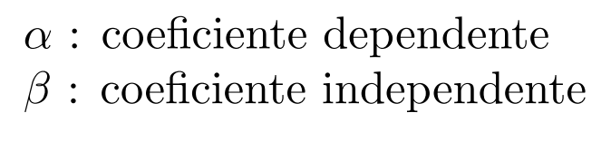
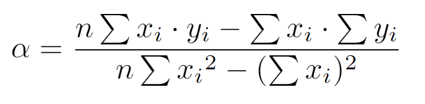

# Regrssão Linear

>"Regressão linear é um algoritmo supervisionado de machine learning usado para estimar o valor de algo baseado em uma série de outros dados históricos, portanto olhando para o passado você pode 'prever' o futuro".

## Origem

O termo 'Regressão' surgiu em 1885 com o antropólogo, matemático e estatístico Francis Galton. Ele aplicava estes conceitos no estudo do corpo humano.

Ao estudar as estaturas de pais e filhos, Galton observou que filhos de pais com altura baixa em relação à média tendem a ser mais altos que seus pais, e filhos de pais com estatura alta em relação à média tendem a ser mais baixos que seus pais, ou seja, as alturas dos seres humanos em geral tendem a regredir à média.

Regressão linear é um tipo de algoritmo supervisionado, portanto antes de entender como funciona o algoritmo é importante conhecer o que seria aprendizado supervisionado.
 
 

## Algoritmos Supervisionados

Os **algoritmos supervisionados** podem ser subdivididos em **algoritmos de classificação** e **algoritmos de regressão**.

Uma das características mais importantes neste aprendizado é que os dados usados no treino do modelo devem ser “rotulados”, ou seja, nos dados de treino eu preciso ter os dados anotados com o valores corretos e nós sabemos do resultado de saída.

Assim como nos algoritmos de classificação onde, primeiramente, nós coletamos os dados que serão utilizados para que a máquina possa procurar por padrões e gerar um modelo, os algoritmos de regressão procuram gerar previsões a partir dos dados coletados e analisados.

Um exemplo claro disso seria uma empresa de seguros. Onde imaginando que ela tenha um banco de dados de todos os seus usuários contendo informações como: idade, sexo, região, quanto cada cliente recebeu de prêmio, entre outras, seja possível gerar um modelo que preveja a quantia que um novo cliente receberá de prêmio do seguro.

Sendo assim, um modelo de machine learning aprende os padrões dos dados e cria matematicamente uma função para gerar previsões.

 
 

## Tipos de Regressão

- Regressão linear simples : refere-se quando temos somente uma variável independente (X) para fazermos a predição.

- Regressão linear múltipla: refere-se a várias variáveis independentes (X)usadas para fazer a predição.

E com isso a forma de representação de cada regressão varia conforme o tipo, como por exemplo a representação gráfica em uma regressão linear simples é uma reta em um plano de 2 dimensões, já em uma regressão linear múltipla, sua representação é feita em um plano que pode ser nD.

## Onde podemos usar a Regressão Linear?

Esse algoritmo pode ser utilizado em qualquer problema, onde as variáveis de entrada e saída são valores contínuos. Por exemplo:

· Prever as vendas de um determinado produto

· Setor imobiliário (valor de um imóvel)

· Calcular a expectativa de vida de um país

· Calcular a pressão sanguínea de um paciente

## Quando aplicar?

Esse tipo de algoritmo é aplicado quando há uma boa correlação linear (positiva ou negativa) entre os dados, ou seja, quando o relacionamento ou associação entre os dados pode ser definido com uma reta.

O objetivo da regressão linear é encontrar uma reta que consiga definir bem os dados e minimizar a diferença entre o valor real e a saída calculada pelo modelo. A função que representa bem a regressão linear é dado a seguir:

Onde w0 (representa o ponto inicial da reta)e w1 (representa a inclinação da reta, ou seja, o quanto que essa variável cresce conforme o tempo passa) são variáveis que o algoritmo calcula para poder definir a reta, e x1 seria o atributo de entrada que foi dada ao modelo.

## Métricas de Validação

Como toda estimativa tende a trazer consigo algum erro, nós podemos pensar em pelo menos três métricas para quantificá-lo.

### MAE - Erro Médio absoluto (Mean Absolute Error)

O MAE é a métrica de erro de regressão mais simples de entender. Ele calcula o valor dos resíduos para cada um dos pontos e depois é tirado a média de todos esses resíduos.

### MSE (Média dos erros ao quadrado)

O MSE é apenas o cálculo do erro mas elevamos ao quadrado.

### SQR (Soma dos Quadrados dos Resíduos)

Soma dos quadrados dos resíduos, mostra a variação de Y que não é explicada pelo modelo elaborado.

O R² é uma medida estatística de quão próximos os dados estão da linha de regressão ajustada. Ele também é conhecido como o coeficiente de determinação ou o coeficiente de determinação múltipla para a regressão múltipla.

O R² está sempre entre 0 e 1:

- **0:** indica que o modelo não explica nada da variabilidade dos dados de resposta ao redor de sua média.
- **1:** indica que o modelo explica toda a variabilidade dos dados de resposta ao redor de sua média.

## Como calcular a reta de regressão?

A equação da reta assemelha-se muito à uma reta  

Onde

Com isso definimos o Alpha:

## Exemplos

Neste diretório há dois arquivos em python que implementam dois modelos de regressão linear, um de regressão simples e outro de regressão múltipla.